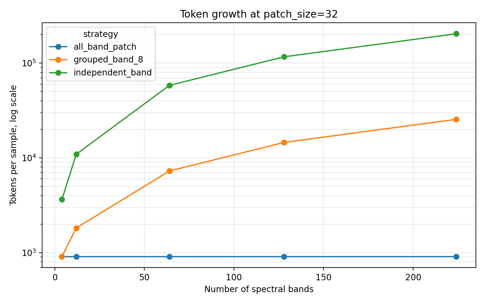
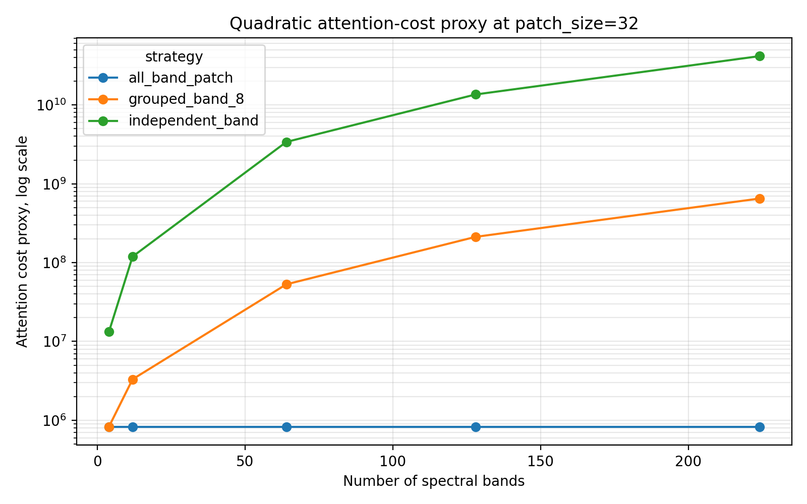
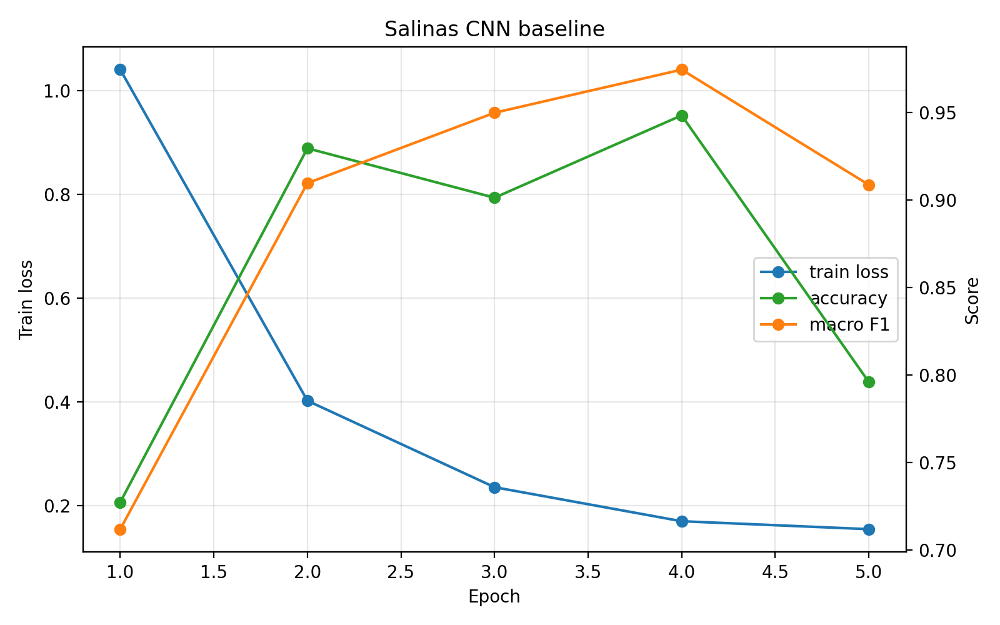
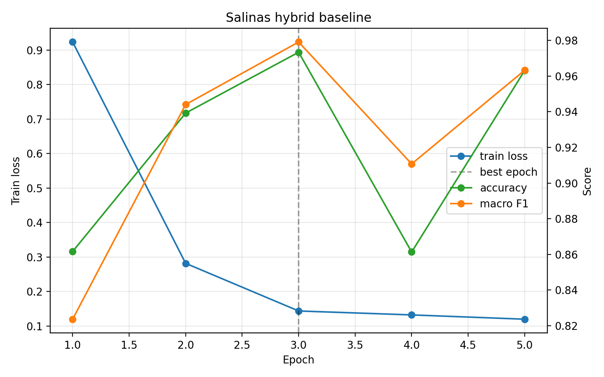
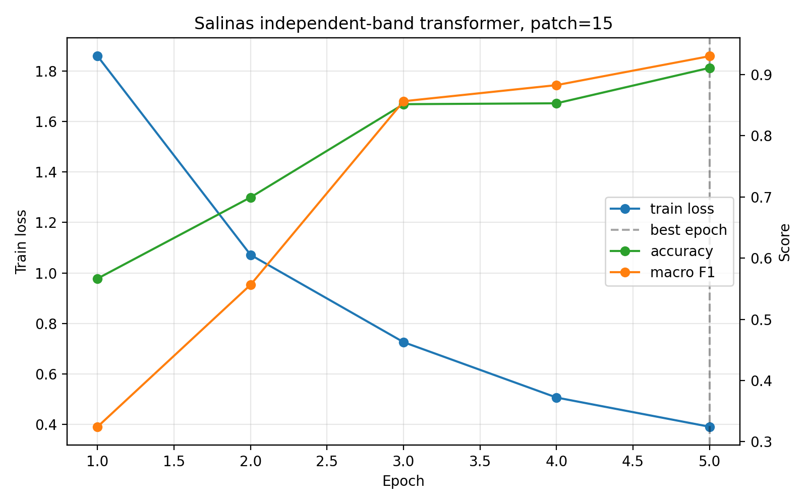
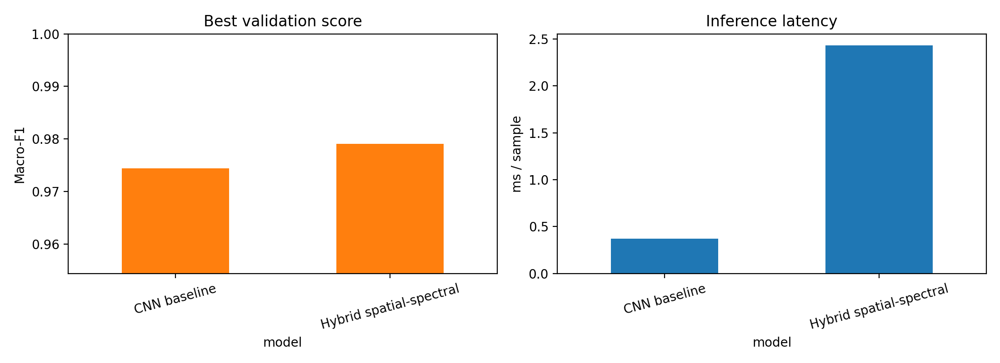

# Results

This page curates the lightweight outputs from the current experiments. Raw datasets, virtual environments, generated checkpoints, and full `outputs/` artifacts are intentionally not tracked in Git.

## 1. Token Scaling Bottleneck

Independent band tokenization creates tokens as:

```text
tokens = spatial_patches * spectral_bands
```

Full self-attention then scales roughly as:

```text
attention_cost ~= tokens^2
```

This is the central bottleneck studied in the project.





At `patch_size=32`, increasing from multispectral to hyperspectral band counts makes the independent-band sequence grow much faster than grouped-band or all-band patch tokenization.

## 2. Salinas Classification Results

The first labeled benchmark is Salinas, a 204-band AVIRIS hyperspectral dataset with 16 classes. These results use a random pixel split, so they are useful as a first sanity-check benchmark. A future spatial split is needed for stronger paper-quality evaluation.

| Model | Best Epoch | Accuracy | Macro-F1 |
|---|---:|---:|---:|
| CNN baseline | 4 | 0.9482 | 0.9744 |
| Hybrid spatial-spectral | 3 | 0.9733 | 0.9791 |
| Independent-band transformer `p=15` | 5 | 0.9110 | 0.9301 |

The hybrid spatial-spectral model gives the strongest result so far. It improves accuracy by about `+2.51` percentage points over the CNN baseline and by about `+6.24` percentage points over the coarse independent-band transformer baseline.







## 3. Efficiency Results

| Model | Parameters | Accuracy | Macro-F1 | CPU Latency / Sample |
|---|---:|---:|---:|---:|
| CNN baseline | 126,480 | 0.9482 | 0.9744 | 0.372 ms |
| Hybrid spatial-spectral | 605,712 | 0.9733 | 0.9791 | 2.433 ms |

The hybrid model is more accurate, but it is also larger and slower than the CNN baseline on CPU. This is an expected trade-off because the hybrid model adds a spectral attention branch and gated fusion.



## 4. Patch Size Trade-off

In the independent-band transformer, `transformer_patch_size` controls how much spatial area is merged into each band token.

| Transformer Patch Size | Bands | Tokens | Attention Cost Proxy |
|---:|---:|---:|---:|
| 1 | 204 | 45,900 | 2,106,810,000 |
| 3 | 204 | 5,100 | 26,010,000 |
| 5 | 204 | 1,836 | 3,370,896 |
| 15 | 204 | 204 | 41,616 |

Increasing patch size reduces token count and latency because each token covers a larger spatial region. However, it also reduces accuracy because the model loses fine spatial information. For Salinas, `p=15` creates only 204 tokens, but each token summarizes an entire `15x15` spatial patch for one band. That coarse tokenization removes local spatial texture, crop boundaries, and neighborhood patterns that help classification. This is one reason the independent-band transformer with `p=15` reached only `0.9110` accuracy and `0.9301` macro-F1.

Decreasing patch size preserves more spatial detail, but it increases latency and memory because the number of tokens rises sharply and attention scales quadratically. For example, going from `p=15` to `p=5` increases the token count from `204` to `1,836`, while the attention-cost proxy increases from `41,616` to `3,370,896`. At `p=1`, the model would use `45,900` tokens and an attention-cost proxy above `2.1e9`, which is not practical for CPU training.

This trade-off supports the project hypothesis: spatial structure should be modeled efficiently with local operators, while attention should be used selectively for spectral relationships.

## 5. Current Takeaway

The current evidence supports the hybrid direction:

1. Independent band tokenization scales poorly as band count increases.
2. A CNN is fast and strong, but lacks explicit spectral attention.
3. A coarse independent-band transformer is slower and less accurate than the hybrid.
4. The hybrid spatial-spectral model currently gives the best Salinas accuracy and macro-F1.

The next research step is to add a spatial train/test split and evaluate whether the hybrid advantage remains under stricter geographic separation.

